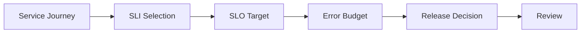

# Framework Overview

## What This Repository Does

This repository defines how to design and operate cloud systems around service level objectives, error budgets, and reliability tradeoffs.
It provides a common language for balancing service health, delivery pace, and cost.
The framework is meant to make the tradeoffs visible before they become incidents.

## SLO Flow

## What It Covers

- SLO definition
- SLI measurement
- error budget governance
- reliability scoring
- performance optimization
- executive reporting

## Who Uses It

- SRE teams
- platform engineering teams
- cloud engineering teams
- executives responsible for reliability outcomes
- product and service owners

## What Good Looks Like

- targets are tied to user journeys
- budgets guide release decisions
- incident reviews are consistent
- reliability and cost are balanced deliberately
- service owners understand the tradeoffs they are making

## How To Read It

Start with the framework overview, then move into SLO strategy and error budget handling.
That sequence keeps the discussion focused on what should be protected before the team gets into how to measure it.

## Result

The framework helps teams choose the right reliability targets and use them to guide delivery decisions.

## Practical Use

Use this framework when you need to explain how SLOs and error budgets should influence engineering decisions.

## Outputs

- SLO strategy
- error budget model
- reliability scorecard
- dashboard
- review templates

## SLO Layers

| Layer | Question | Artifact |
| --- | --- | --- |
| Journey | What user experience matters? | SLO strategy |
| Measurement | What will we observe? | SLI examples |
| Threshold | What is acceptable? | SLO template |
| Control | When do we slow down? | Error budget model |
| Reporting | What should leaders see? | Executive reporting |

## Decision Rule

If an SLO does not change behavior or decision-making, it is probably not useful enough to keep as a first-class objective.
